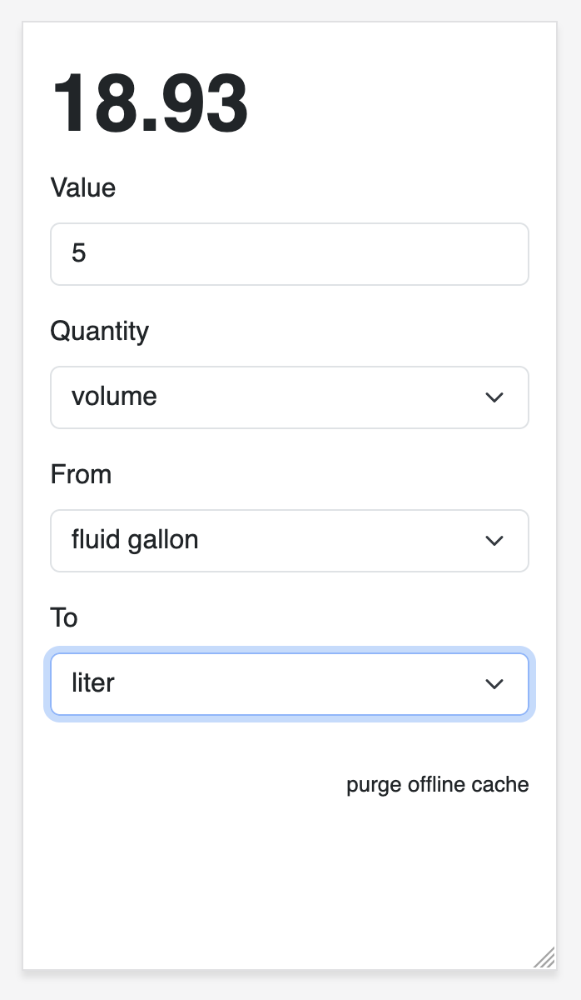

# convert



Convert is a simple web application for converting measurements which is designed to work offline (using ServiceWorkers).

## Motivation

I wanted a simple web application for converting measurements which is designed to work offline (using ServiceWorkers) so this is that tool. It converts units from one measurement to another and nothing else.

Under the hood it uses a WebAssembly (WASM) binary which wraps the [bcicen/go-units](https://github.com/bcicen/go-units) Go package. This is _not_ the most efficient way to do things.

In addition to wanting a simple offline application I also wanted to continue investigating the use of WASM binaries for providing functionality in (offline) web applications. Go produces large binaries, certainly compared to the size of equivalent functionality written in JavaScript. For example, the `convert.wasm` binary used by this application is 4MB. I can live with that, at least for now.

## Offline mode

This _should_ work in offline mode. It _seems_ to work for me but ServiceWorkers and offline-anything in browsers is fussy and brittle so if you tell me it doesn't work for you I won't be overly surpised.

## Units

The `bcicen/go-units` package for most conversions but add custom definitions for standard US/North American cooking units like cups, teaspoons and tablespoons.

## Demo

I tried making a "github pages" demo but the WASM binary is being delivered as Base64 (?) encoded gibberish and I have not figured out a workaround. In the meantime you can test the application by point any old web-server tool at the [www](www) directory.

I like to use the [aaronland/go-http-fileserver](https://github.com/aaronland/go-http-fileserver) tool but that's most because I wrote it but anything should work. For example:

```
$> fileserver -root www/
2025/04/28 09:07:14 Serving www/ and listening for requests on http://localhost:8080
```

## Building

If you need or want to rebuild the `convert.wasm` binary the easiest thing to do is run the handy `wasmjs` Makefile target, like this:

```
$> make wasmjs && make debug
GOOS=js GOARCH=wasm \
		go build -mod vendor -ldflags="-s -w" \
		-o www/wasm/convert.wasm \
		cmd/convert/main.go
```

## See also

* https://github.com/bcicen/go-units
* https://github.com/sfomuseum/js-sfomuseum-golang-wasm